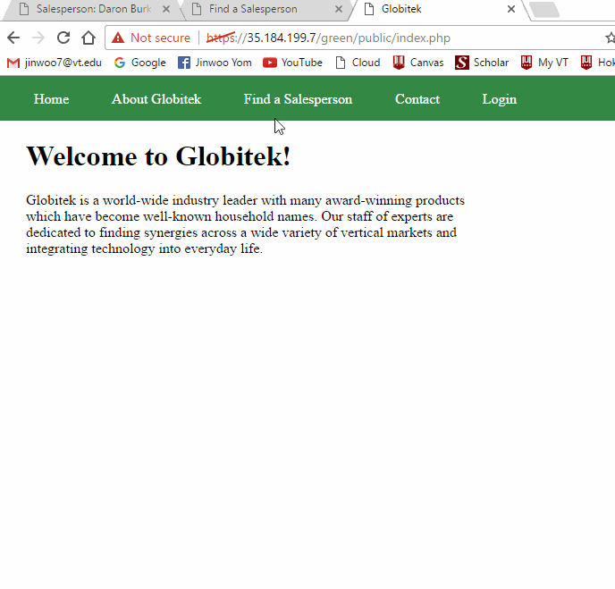
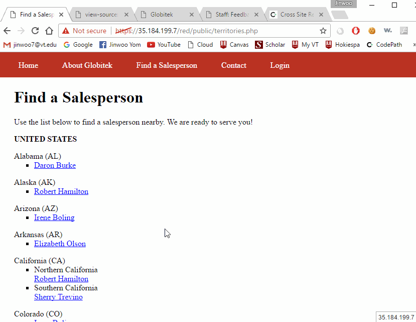

Time spent: 7 hours spent in total

> Objective: Identify vulnerabilities in three different versions of the Globitek website: blue, green, and red.

The six possible exploits are:

* Username Enumeration
* Insecure Direct Object Reference (IDOR)
* SQL Injection (SQLi)
* Cross-Site Scripting (XSS)
* Cross-Site Request Forgery (CSRF)
* Session Hijacking/Fixation

Each color is vulnerable to only 2 of the 6 possible exploits. First discover which color has the specific vulnerability, then write a short description of how to exploit it, and finally demonstrate it using screenshots compiled into a GIF.

## Blue

Vulnerability #1: SQL Injection

Description:
Attacker injects a sql command instead of the salesperson's ID Number.
this causes the database command to wait for 5 seconds while quering the data.
The Victim's session ID is obtained through the tool that is provided by the codepath
Using burp, we can intercept the attacker's access attempt to and secure site
 From the intercepted packet, we can modify the session ID to the one we obtained from the Victim.
 Once the packet is forwarded, the attacker is logged in using the Victim's session ID

## Green

Vulnerability #1: Username Enumeration

Description:
The Green Website has the Username Enumeration error where the failure to login message differs for the Username that exists vs doesn't exist.
 Using Chrome's debugging tool, I was able to see that the Developer assigns two different classes, failed and failure, to the error message depending on the login senerio.
 The "failure" class is applied an bold style in css while "failed" class doesn't. 
 Vulnerability #2: Cross-Site Scripting (XSS)
 
 Attacker can inject an XSS in their feedback form.
 Injected XSS Command:
 
 This XSS runs once the account holder checks their feedback page

## Red

Vulnerability #1: Cross-Site Request Forgery (CSRF)

Description:
Created a malicious page that utilizes the user's session to forge a request to the database
This page secretly makes a post request on page load and hides the outcome in a hidden iframe.
 As result, an account in the database is altered.
 

## Notes

Describe any challenges encountered while doing the work

